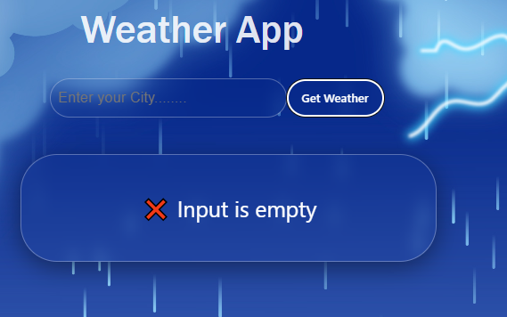
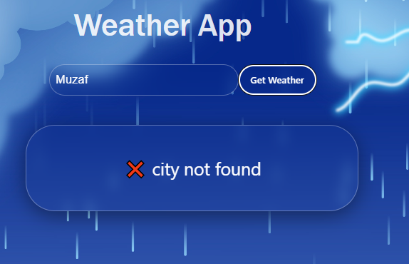
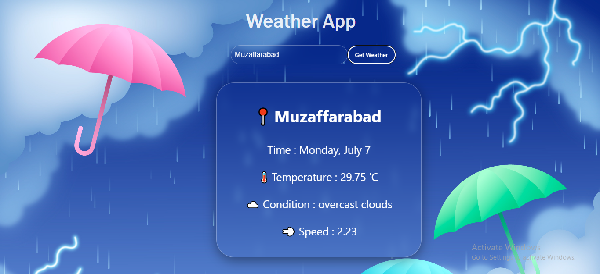

# ⛅ Weather App 🌍

A simple yet functional **Weather Application** that allows you to search the weather of any city worldwide! 🌐

---

## ✨ Features

✔️ Search current weather by city name 🏙️  
✔️ Displays temperature, weather conditions, and more ☁️  
✔️ Real-time API integration 🌐  
✔️ Input validation with error handling ⚠️  
✔️ Clean and responsive UI 🎨  

---

## ⚡ Validation & Error Handling

✅ **Empty Input**  
- If the input is left blank, the app shows an **Error Message: "Input is empty"**  

<p align="center">
  
</p>

---

✅ **Invalid City Name**  
- If the entered city name is incorrect or not found, the app shows an **Error Message: "City not found"**  

<p align="center">
  
</p>

---

✅ **Correct City Name**  
- If a valid city name is entered, the weather details are displayed properly 🌦️  

<p align="center">
  
</p>

---

## 🛠️ Technologies Used

- ⚛️ **ReactJS** (or Vanilla JavaScript if applicable)  
- 🎨 **CSS**  
- 🌐 **Weather API**  

---

## 🚀 How to Run

1. Make sure **Node.js** and **npm** are installed (for ReactJS version)  
2. Clone or download the project  
3. Run the following commands in your terminal:  

```bash
npm install  
npm start  
